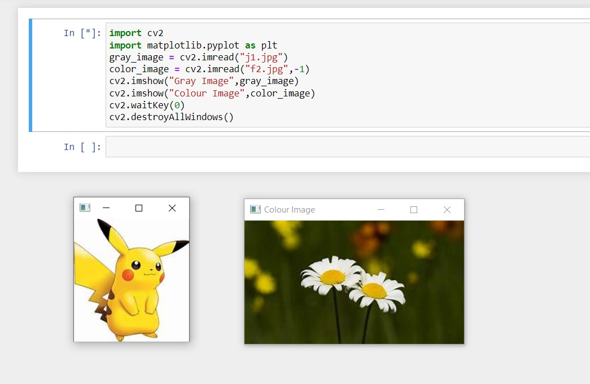
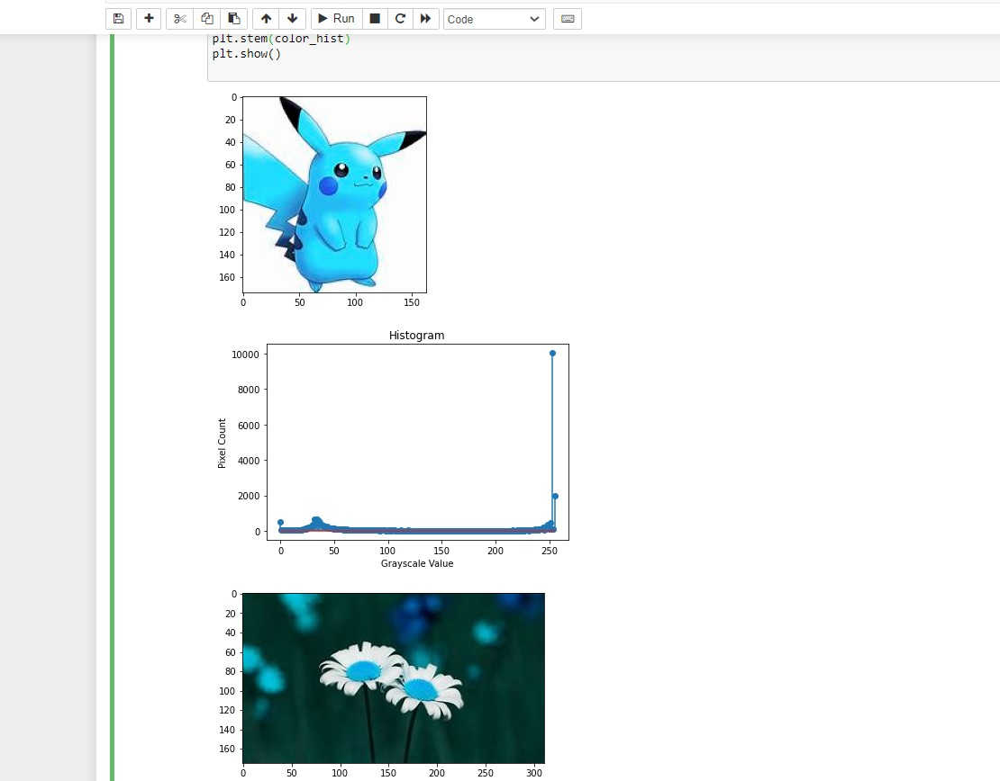
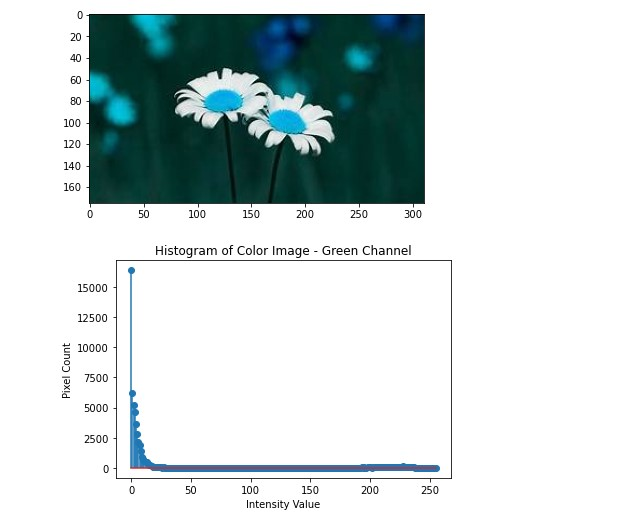
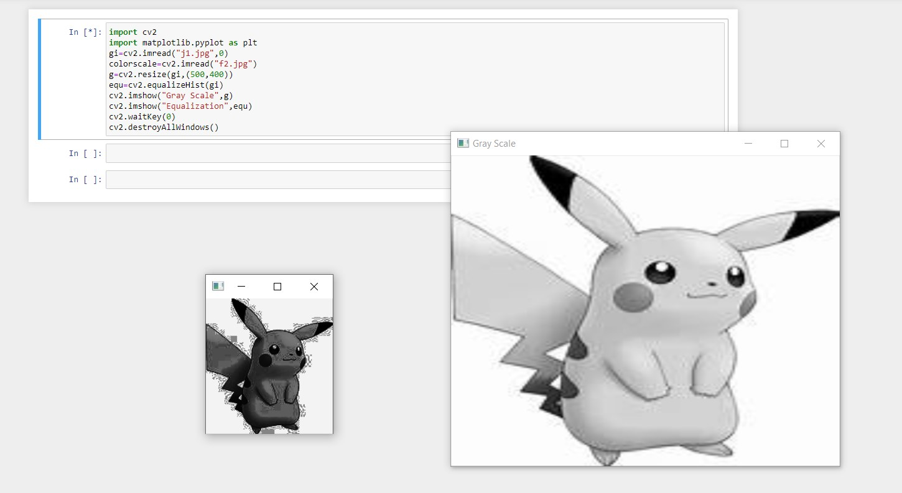

# Histogram and Histogram Equalization of an image
## Aim
To obtain a histogram for finding the frequency of pixels in an Image with pixel values ranging from 0 to 255. Also write the code using OpenCV to perform histogram equalization.

## Software Required:
Anaconda - Python 3.7

## Algorithm:
### Step1: 
Read the gray and color image using imread()
<br>

### Step2:
Print the image using imshow().
<br>

### Step3:

Use calcHist() function to mark the image in graph frequency for gray and color image.
<br>

### Step4:
cv2.equalize() is used to transform the gray image to equalized form.
<br>

### Step5:
The Histogram of gray scale image and color image is shown.
<br>

## Program:
```python
# Developed By:M.S.Jeeva
# Register Number:212221230040
import cv2
import matplotlib.pyplot as plt

# Write your code to find the histogram of gray scale image and color image channels.
import cv2
import matplotlib.pyplot as plt
gray_image = cv2.imread("j1.jpg")
color_image = cv2.imread("f2.jpg",-1)
cv2.imshow("Gray Image",gray_image)
cv2.imshow("Colour Image",color_image)
cv2.waitKey(0)
cv2.destroyAllWindows()


# Display the histogram of gray scale image and any one channel histogram from color image
import cv2
import matplotlib.pyplot as plt
gray_image = cv2.imread("j1.jpg")
color_image = cv2.imread("f2.jpg")
gray_hist = cv2.calcHist([gray_image],[0],None,[256],[0,256])
color_hist = cv2.calcHist([color_image],[0],None,[256],[0,256])
plt.figure()
plt.imshow(gray_image)
plt.show()
plt.title("Histogram")
plt.xlabel("Grayscale Value")
plt.ylabel("Pixel Count")
plt.stem(gray_hist)
plt.show()
plt.imshow(color_image)
plt.show()
plt.title("Histogram of Color Image - Green Channel")
plt.xlabel("Intensity Value")
plt.ylabel("Pixel Count")
plt.stem(color_hist)
plt.show()


# Write the code to perform histogram equalization of the image. 
import cv2
import matplotlib.pyplot as plt 
gi=cv2.imread("j1.jpg",0)
colorscale=cv2.imread("f2.jpg")
g=cv2.resize(gi,(500,400))
equ=cv2.equalizeHist(gi)
cv2.imshow("Gray Scale",g)
cv2.imshow("Equalization",equ)
cv2.waitKey(0)
cv2.destroyAllWindows()


```
## Output:
### Input Grayscale Image and Color Image

<br>
<br>
<br>
<br>

### Histogram of Grayscale Image and any channel of Color Image


<br>
<br>
<br>
<br>

### Histogram Equalization of Grayscale Image

<br>
<br>
<br>
<br>

## Result: 
Thus the histogram for finding the frequency of pixels in an image with pixel values ranging from 0 to 255 is obtained. Also,histogram equalization is done for the gray scale image using OpenCV.
